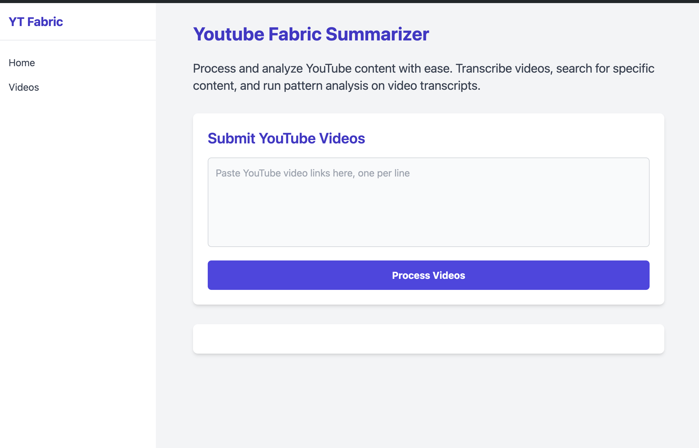
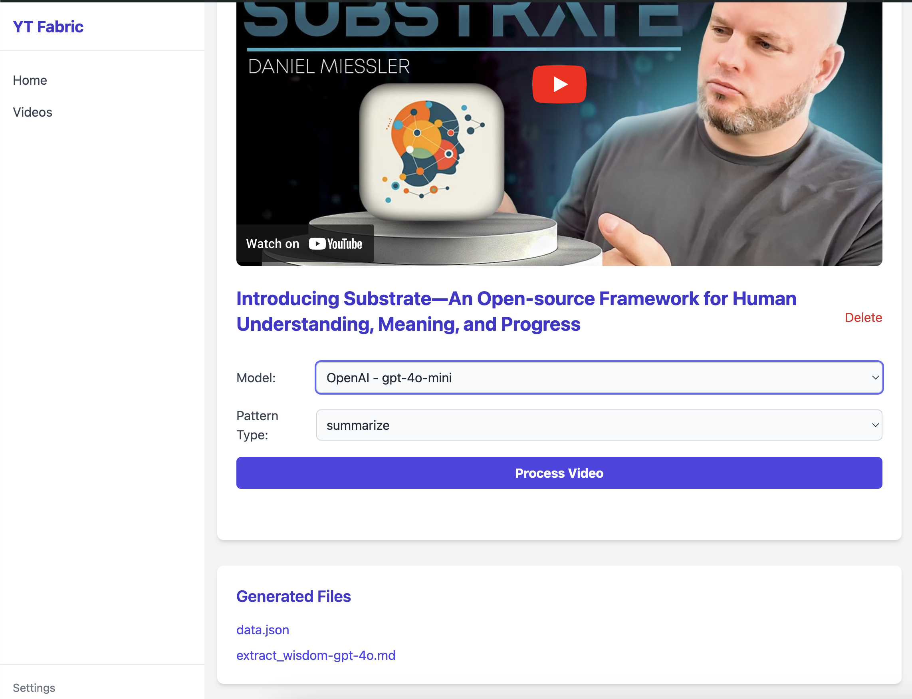
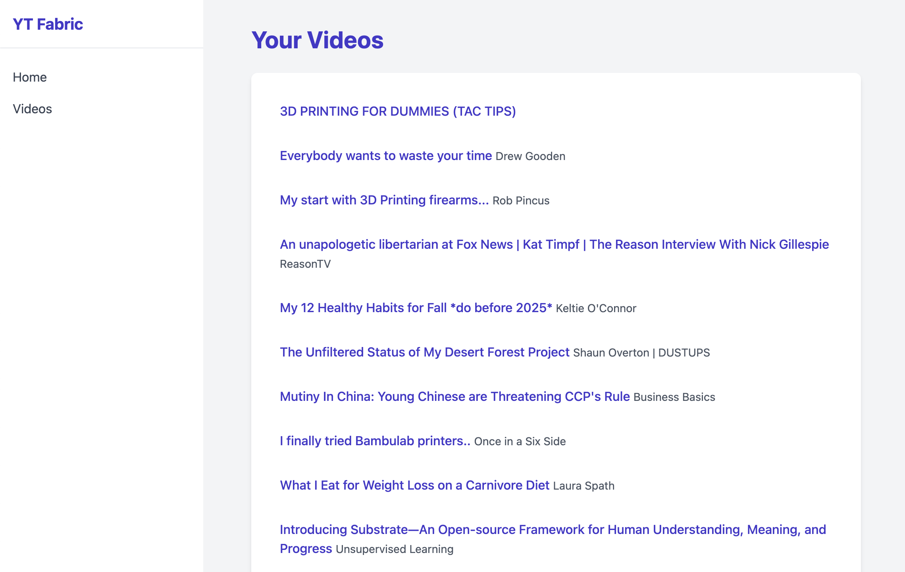

# yt-fabric-ui

This project is an early work in progress (WIP) that provides a web UI around [fabric](https://github.com/danielmiessler/fabric) for processing YouTube transcripts with Fabric patterns.

## Table of Contents

- [Installation](#installation)
- [Usage](#usage)
- [Reverse Proxy Support](#reverse-proxy-support)
- [Security: Protecting `.env`](#security-protecting-env)
- [Screenshots](#screenshots)
- [Contributing](#contributing)

## Installation

1. **Install Go** (https://golang.org/dl/)
2. **Install Fabric**:

   ```sh
   go install github.com/danielmiessler/fabric@latest
   ```

3. **Initialize Fabric**:

   ```sh
   fabric --setup
   ```

4. **Run the web server**:

   ```sh
   go run main.go
   ```

By default, the app listens on `http://localhost:8085`.

## Usage

- Open the UI in your browser
- Add YouTube links on the home page
- View processed videos under **Videos**

## Access Management

The app supports optional built-in access management with local users, sessions, and roles.

### Enable auth

Set these environment variables before starting the app:

- `AUTH_ENABLED=true`
- `AUTH_BOOTSTRAP_ADMIN_USER=<admin-username>`
- `AUTH_BOOTSTRAP_ADMIN_PASS=<admin-password>`

Optional settings:

- `AUTH_SESSION_DURATION=8h` (Go duration format)
- `AUTH_COOKIE_SECURE=true` (recommended when served over HTTPS)

### Global Fabric model parameters

You can define global Fabric generation parameters (applied to every processing call):

- `FABRIC_GLOBAL_TEMPERATURE`
- `FABRIC_GLOBAL_TOP_P`
- `FABRIC_GLOBAL_PRESENCE_PENALTY`
- `FABRIC_GLOBAL_FREQUENCY_PENALTY`
- `FABRIC_GLOBAL_RAW`

Example for reasoning models that reject custom temperature:

```env
FABRIC_GLOBAL_RAW=true
```

When `FABRIC_GLOBAL_RAW=true`, the app calls fabric with `--raw` and skips chat option flags like `--temperature` and `--topp`.

### LLM trace details

Per-video `llm-trace-*.log` files now include:

- executed fabric command
- detected service URL (when available)
- request payload summary (pattern/model/global params)
- stderr/error output and model response

If `AUTH_ENABLED` is not set, it defaults to `false` for backward compatibility.

### Roles

- `viewer`: view home/videos/summaries
- `operator`: viewer + submit/process/delete/debug
- `admin`: operator + `/config/*` + `/admin/users`

### Admin UI

When logged in as admin, open **Users** in the sidebar to:

- create users
- change roles
- enable/disable accounts

Implementation notes and rollout checklist are documented in:

- `docs/access-management-plan.md`

> Videos are now shown in **reverse order of addition** (latest video first).

## Reverse Proxy Support

The app supports running behind a reverse proxy and can handle path-prefix deployments (for example `/yt-fabric-ui`) via the `X-Forwarded-Prefix` header.

### Required proxy behavior

1. Forward requests to the Go app (default backend port `8085`)
2. Preserve host/proto headers
3. Set `X-Forwarded-Prefix` when serving under a sub-path

### Nginx example (root path)

```nginx
server {
    listen 80;
    server_name example.com;

    location / {
        proxy_pass http://127.0.0.1:8085;
        proxy_set_header Host $host;
        proxy_set_header X-Real-IP $remote_addr;
        proxy_set_header X-Forwarded-For $proxy_add_x_forwarded_for;
        proxy_set_header X-Forwarded-Proto $scheme;
    }
}
```

### Nginx example (sub-path)

```nginx
server {
    listen 80;
    server_name example.com;

    location /yt-fabric-ui/ {
        proxy_pass http://127.0.0.1:8085/;
        proxy_set_header Host $host;
        proxy_set_header X-Real-IP $remote_addr;
        proxy_set_header X-Forwarded-For $proxy_add_x_forwarded_for;
        proxy_set_header X-Forwarded-Proto $scheme;
        proxy_set_header X-Forwarded-Prefix /yt-fabric-ui;
    }
}
```

## Security: Protecting `.env`

Fabric credentials are stored in `~/.config/fabric/.env`. This file must never be publicly accessible.

### Recommendations

1. Keep `.env` outside public/static web roots (already the default with Fabric)
2. Block direct access to `.env` at the reverse proxy layer
3. Restrict access to the `/config/env` UI route (VPN, IP allowlist, or auth)

### Nginx hardening rules

```nginx
# Block direct access to any .env-like file
location ~ (^|/)\.env {
    deny all;
    return 403;
}

# Optional: protect config editing endpoints
location /config/env {
    # Example: only internal network
    allow 10.0.0.0/8;
    allow 192.168.0.0/16;
    deny all;

    proxy_pass http://127.0.0.1:8085;
    proxy_set_header Host $host;
    proxy_set_header X-Forwarded-Proto $scheme;
}
```

## Screenshots

### Home Page


### Video Page


### Videos List


## Contributing

Contributions are welcome! If you have ideas, suggestions, or bug reports, open an issue or submit a pull request.


